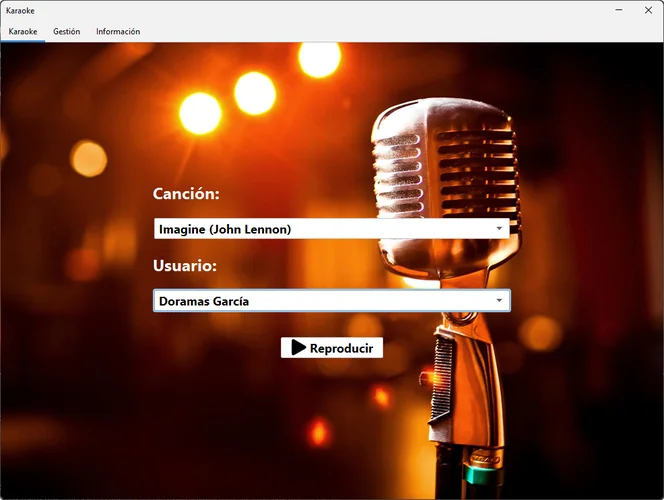
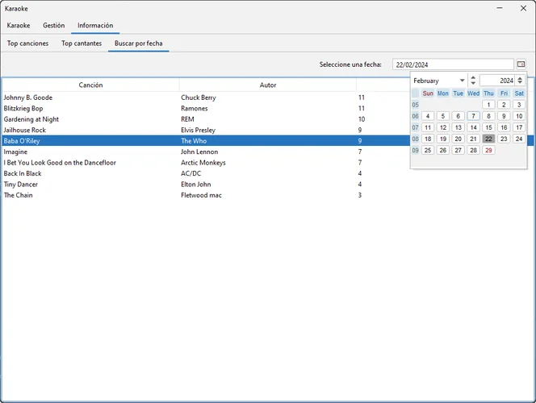
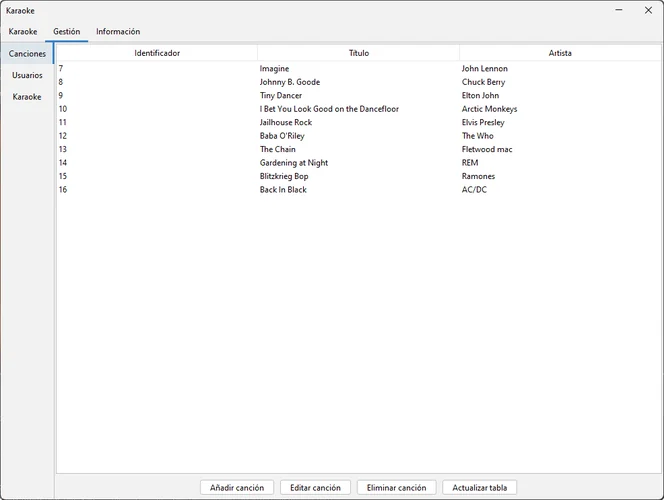
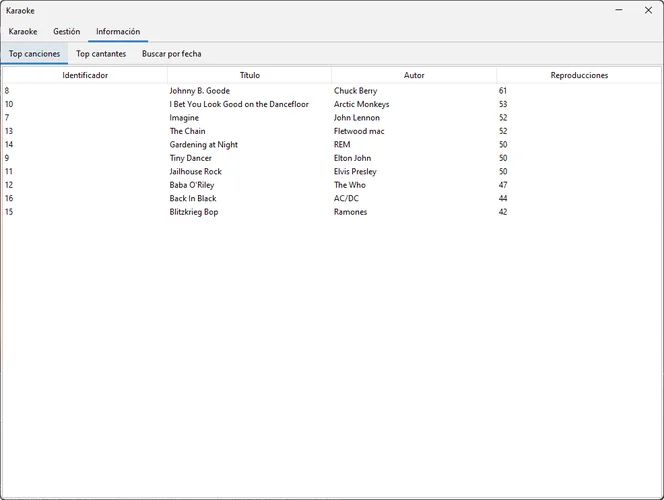

# Karaoke

**Karaoke** is a musical karaoke database manager.

The project was built using **Java**, **Java Swing** and **SQL**.

> [!NOTE]  
This application was developed during my time as a student, under a tight
deadline and while managing other projects. It offers the core functionality,
but you may encounter bugs, rough edges, and code that’s not production-ready.

# Media

  
  
  
  

